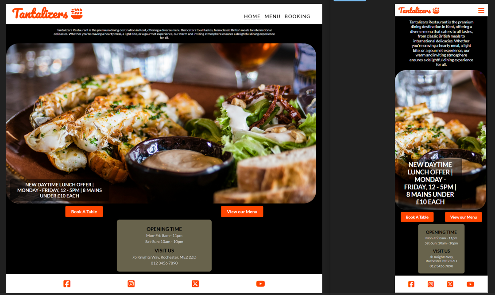
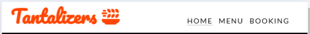
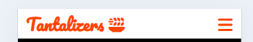
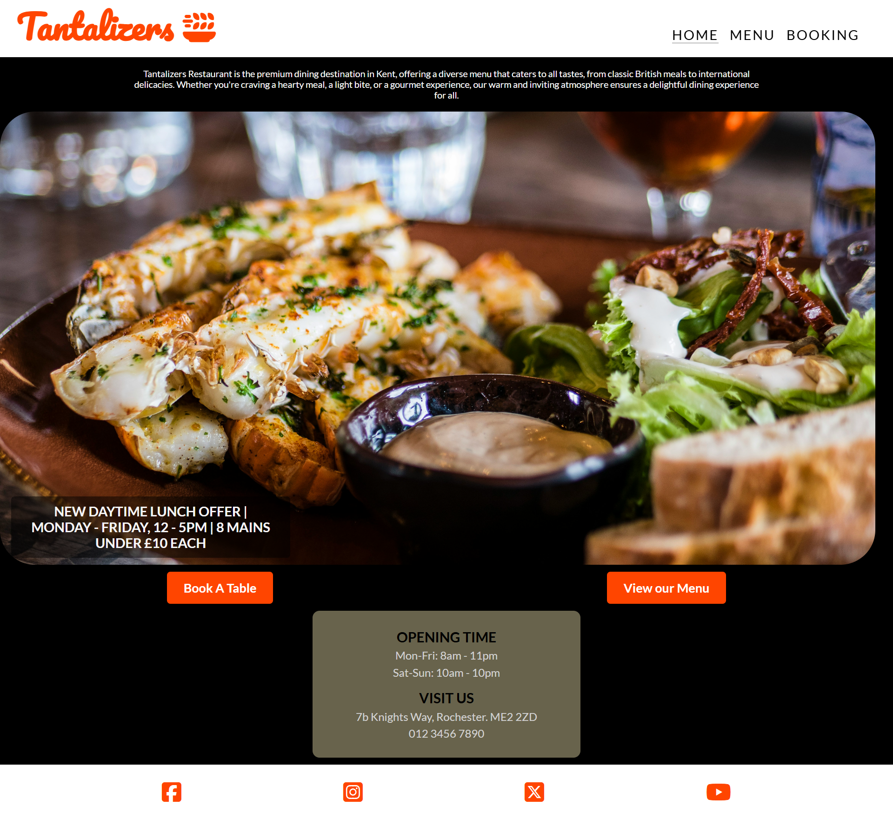
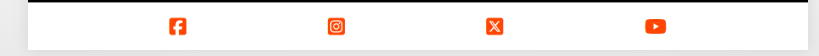

# *Tantalizers Restaurant*
Welcome to the Tantalizers restaurant website! This project aims to provide a seamless online experience for our customers, allowing them to easily browse the menu, make reservations, and receive booking confirmations—all from the comfort of their home.

This site can be accessed by this [link] (https://ola-olawoyin.github.io/tantalizers/)

Project Goals:
This project goal is to showcase web development techniques, mainly HTML and CSS as MVP and without including Javascript nor any back-end integration.
The form is pointed to [Code Institute Form Dump](https://formdump.codeinstitute.net) as backend integration is not available at this time.

## User Stories

### All pages
* As a guest or user I want to be able to navigate to the restaurant's social media handles so that I can keep myself updated with restaurant's latest information.
* As a guest or user I want to be able to navigate to the Homepage using the restaurant's logo so that I can quickly return to the landing page from any page.

### Landing page (Index.html)
* As a guest or user I want to see an inviting homepage with high-quality image of an appealing meal, a welcome message and offers, so that I can get a great first impression of the restaurant.
* As a guest or user I want to be able to access the booking page from the home page so that I can easily and quickly make a reservation.
* As a guest or user I want to access the menu options so I can quickly decide on the meal to select.
* As a guest or user I want to quickly find the restaurant's opening hours and location details so I can decide if and when to visit.

### Menu Page
* As a guest or user I want to browse the restaurant's menu and the dishes available so I can decide what meal to order.
* As a guest or user I want to see a separated list of the meal categories so that I can quicky decide on meal selection.
* As a guest or user I want to see the images of the appealing meals so I can have an engaging browsing experience.

### Booking Page
* As a user I want to complete a simple booking form with name, email address, phone number and date so that I can reserve a table easily.
* As a user I want to complete an allergy information field so that I can adequately inform the restaurant about my allergies.
* As a user planning a special event, I want an option to leave a special request (e.g Birthday) in the additional information field so that the restaurant can   accomodate my needs.

## Features

+ ### NavBar

+ ##### Navigation
    - Positioned at the top of the page.
    - Contains logo of the restaurant on the left side.
    - Contains navigation links on the right side:
        * HOME - leads to the home page where users can learn about the restaurant.
        * MENU - leads to the menu list and menu images where users can see a list of meals available and the images.
        * BOOKING - leads to the booking page where user can book a table and specify additional information.
    - The navigation is clear and easy to understand for the user.
    
    

    - The navigation bar is responsive:
        * On tablets: navigation displays similar to its desktop, but with logo closer to the navigatiion icons.
        

        * On mobile devices: 
            - The navigation bar filled with the logo on the left and a hamburger menu implemented on the right side of the navigation bar.      
            
        
            - When the hamburger menu is clicked, there is dropdown menu with the links in the same order.
            

+  ### Home Page

    - Represent: 

        * the main idea of the restaurant.
        * invites to fill out the book a table form.
        * invites to view the menu list
        * lists the opening time and location of the restaurant

    

---

+  ### Menu Page

    - Represent: 

        * the list of available meals.
        * the images of different dishes.
        * invitation to fill out the book a table form.

    

---

+  ### Booking Page

    - Represent: 

        * A simple form to book a table.
        * An option to specify special request.
        * A submission button that creates a confirmation for the data entry

    

--- 

+ ##### Footer
    - There are four social media links (currently not navigating to the social media homepage respectively)

     

---
## Technologies Used
- [Favicon](https://icons8.com/icons/set/favicon-food) was used as source from which favicon was seleceted
- [HTML](https://developer.mozilla.org/en-US/docs/Web/HTML) was used as the foundation of the site.
- [CSS](https://developer.mozilla.org/en-US/docs/Web/css) - was used to add the styles and layout of the site.
- [Balsamiq](https://balsamiq.com/) was used to make wireframes for the website.
- [VSCode](https://code.visualstudio.com/) was used as the main tool to write and edit code.
- [Git](https://git-scm.com/) was used for the version control of the website.
- [GitHub](https://github.com/) was used to host the code of the website.
- [GIMP](https://www.gimp.org/) was used to resize images to align

---

## Deployment

### Deployment to GitHub Pages

- The site was deployed to GitHub pages. The steps to deploy are as follows: 
  - In the [GitHub repository](https://github.com/Ola-Olawoyin/tantalizers), navigate to the Settings tab 
  - From the source section drop-down menu, select the **Main** Branch, then click "Save".
  - The page will be automatically refreshed with a detailed ribbon display to indicate the successful deployment.

The live link can be found [here](https://ola-olawoyin.github.io/tantalizers)

### Local Deployment

In order to make a local copy of this project, you can clone it.
In your IDE Terminal, type the following command to clone my repository:

- `git clone https://github.com/Ola-Olawoyin/tantalizers.git`

---

## Acknowledgments

- [Juliia Konovalova](https://github.com/IuliiaKonovalova) for mentoring and support.
- [Mark Lassoff](https://www.udemy.com/course/become-a-certified-web-developer) for HTML and CSS tutoring.
- [Code Institute](https://codeinstitute.net/) tutors and Slack community members for their support and help.
- [Lipika Magon](https://www.linkedin.com/in/lmagon) for spending time discussing project idea.
- [Sean Darley](https://www.linkedin.com/in/seandarley) for helping with testing the application.
- My wife [Adeola Olawoyin](https://www.linkedin.com/in/adeola-olawoyin-02550232) for providing support and encouragement and also the main tester of the application.

---

## Testing

