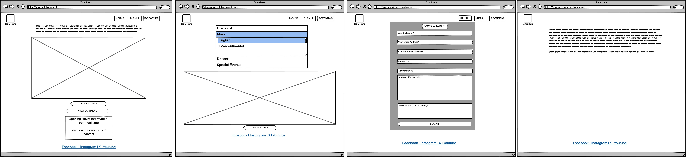
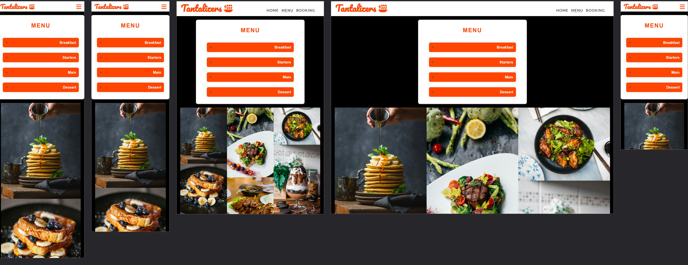

# *Tantalizers Restaurant*
Welcome to the Tantalizers restaurant website! This project aims to provide a seamless online experience for our customers, allowing them to easily browse the menu, make reservations, and receive booking confirmations—all from the comfort of their home.

This site can be accessed by this [link](https://ola-olawoyin.github.io/tantalizers/)

Project Goals:
This project goal is to showcase web development techniques, mainly HTML and CSS as MVP and without including Javascript nor any back-end integration.
The booking form is pointed to a [Response Page](https://ola-olawoyin.github.io/tantalizers/response.html) as backend integration is not available at this time.

## User Stories

### All pages
* As a guest or user I want to be able to navigate to the restaurant's social media handles so that I can keep myself updated with restaurant's latest information.
* As a guest or user I want to be able to navigate to the Homepage using the restaurant's logo so that I can quickly return to the landing page from any page.

### Landing page (Index.html)
* As a guest or user I want to see an inviting homepage with high-quality image of an appealing meal, a welcome message and offers, so that I can get a great first impression of the restaurant.
* As a guest or user I want to be able to access the booking page from the home page so that I can easily and quickly make a reservation.
* As a guest or user I want to access the menu options so I can quickly decide on the meal to select.
* As a guest or user I want to quickly find the restaurant's opening hours and location details so I can decide if and when to visit.

### Menu Page
* As a guest or user I want to browse the restaurant's menu and the dishes available so I can decide what meal to order.
* As a guest or user I want to see a separated list of the meal categories so that I can quicky decide on meal selection.
* As a guest or user I want to see the images of the appealing meals so I can have an engaging browsing experience.

### Booking Page
* As a user I want to complete a simple booking form with name, email address, phone number and date so that I can reserve a table easily.
* As a user I want to complete an allergy information field so that I can adequately inform the restaurant about my allergies.
* As a user planning a special event, I want an option to leave a special request (e.g Birthday) in the additional information field so that the restaurant can   accomodate my needs.

### Response Page
* As a user I want to see a confirmation of the table booking I just made on a separate page.

## Features

+ ### NavBar

+ ##### Navigation
    - Positioned at the top of the page.
    - Contains logo of the restaurant on the left side.
    - Contains navigation links on the right side:
        * HOME - leads to the home page where users can learn about the restaurant.
        * MENU - leads to the menu list and menu images where users can see a list of meals available and the images.
        * BOOKING - leads to the booking page where user can book a table and specify additional information.
    - The navigation is clear and easy to understand for the user.
    
    

    - The navigation bar is responsive:
        * On tablets: navigation displays similar to its desktop, but with logo closer to the navigatiion icons.
        

        * On mobile devices: 
            - The navigation bar filled with the logo on the left and a hamburger menu implemented on the right side of the navigation bar.      
            
        
            - When the hamburger menu is clicked, there is dropdown menu with the links in the same order.
            

+  ### Home Page

    - Represent: 

        * the main idea of the restaurant.
        * invites to fill out the book a table form.
        * invites to view the menu list
        * lists the opening time and location of the restaurant

    

---

+  ### Menu Page

    - Represent: 

        * the list of available meals.
        * the images of different dishes.
        * invitation to fill out the book a table form.

    

---

+  ### Booking Page

    - Represent: 

        * A simple form to book a table.
        * An option to specify special request.
        * A submission button that creates a confirmation for the data entry

    

--- 

+ ### Response page

    - Response page appears after submitting the contact form.
    - It contains the thank you message and the promise to confirm reservation shortly.
    - It will automatically direct the user to the main page in 10 seconds.

    

---

+ ##### Footer
    - There are four social media links (currently not navigating to the social media homepage respectively)

     

---
## Technologies Used
- [Favicon](https://icons8.com/icons/set/favicon-food) was used as source from which favicon was seleceted.
- [HTML](https://developer.mozilla.org/en-US/docs/Web/HTML) was used as the foundation of the site.
- [CSS](https://developer.mozilla.org/en-US/docs/Web/css) - was used to add the styles and layout of the site.
- [Balsamiq](https://balsamiq.com/) was used to make wireframes for the website.
- [VSCode](https://code.visualstudio.com/) was used as the main tool to write and edit code.
- [Git](https://git-scm.com/) was used for the version control of the website.
- [GitHub](https://github.com/) was used to host the code of the website.
- [GIMP](https://www.gimp.org/) was used to resize images to align.
- [HTML Validator](https://validator.w3.org/).
- [CSS Validator](https://jigsaw.w3.org/css-validator/).

---

## Design

### Color Scheme

- Black color was used as the main background color of the website due to its effect of boldness, clarity and elegance. It create a contrast in the food presentation.

- Orange-Red color was used for the logo, buttons, links icons, and mobile view navbar icon. This is stimutes brightness, excitement and a psycholigical hunger trigger.

- White color for the header background, footer background, most texts and table booking form. This is to provide clarity and contrast to other elements on the pages.

- Mute-Olive for the opening time and visit us container to create contrast and clarity.

### Typography

- Lato Google Font was used as the main font of the website in order to increase readability of the content on the pages.

- Cursive Pacifico Google Font was used to attract viewers' attention to the company's logo, to make strong points 'stylishness' and to incentivize visitors to visit "Tantalizers".

- Sans Sarif Font is used as alternatives to the 'stylish' google fonts for browsers that are not compatible with Google fonts.

---

## Deployment

### Deployment to GitHub Pages

- The site was deployed to GitHub pages. The steps to deploy are as follows: 
  - In the [GitHub repository](https://github.com/Ola-Olawoyin/tantalizers), navigate to the Settings tab 
  - From the source section drop-down menu, select the **Main** Branch, then click "Save".
  - The page will be automatically refreshed with a detailed ribbon display to indicate the successful deployment.

The live link can be found [here](https://ola-olawoyin.github.io/tantalizers)

### Local Deployment

In order to make a local copy of this project, you can clone it.
In your IDE Terminal, type the following command to clone my repository:

- `git clone https://github.com/Ola-Olawoyin/tantalizers.git`

---

## Wireframe

#### Mobile devices

 

#### Desktop devices

 

---

## Testing

## Compatibility

In order to confirm the correct functionality, responsiveness, and appearance:

+ The website was tested on the following browsers: Safari, Chrome, Edge.

    - Safari:

    

    - Chrome:

    

    - Edge:

    

## Responsiveness

+ The website was checked for the following viewport sizes: Mobile, tablet and desktop.

    - Main Page:

    

    - Menu Page:

    

     

    - Contact Page:

    

    - Response Page:

    

+ The functionality of the links in the website was checked as well by different users.

## Manual testing

| feature | action | expected result | tested | passed | comments |
| --- | --- | --- | --- | --- | --- |
| Navbar | | | | | |
| Logo | Click on the "Tantalizers" logo | The user is redirected to the Main page | Yes | Yes | - |
| Home | Click on the "Home" link | The user is redirected to the Main page | Yes | Yes | - |
| Menu | Click on the "Menu" link | The user is redirected to the Menu page | Yes | Yes | - |
| Booking | Click on the "Booking" link | The user is redirected to the Booking page | Yes | Yes | - |
| Footer | | | | | |
| Facebook icon in the footer | Click on the Facebook icon | The user is redirected to the Facebook page | Yes | Yes | - |
| Instagram icon in the footer | Click on the Instagram icon | The user is redirected to the Instagram page | Yes | Yes | - |
| X icon in the footer | Click on the X (Twitter) icon | The user is redirected to the Twitter page | Yes | Yes | - |
| YouTube icon in the footer | Click on the YouTube icon | The user is redirected to the YouTube page | Yes | Yes | - |
| Home page | | | | | |
| "Book A Table" button in Details section | Click on the "Book A Table" button | The user is redirected to the Booking page | Yes | Yes | - |
| "View Our Menu" button in Details section | Click on the "View Our Menu" button | The user is redirected to the Menu page | Yes | Yes | - |
| Menu page | | | | | |
| "Menu list" accordion in menu-accordion section | Click '+' icon in each of the accordion | The menu list for each accordion is displayed | Yes | Yes | - |
| "Menu list" accordion in menu-accordion section | Hover over each menu | The hover effect highlights each of the hovered meal | Yes | Yes | - |
| "Menu list" accordion in menu-accordion section | Click '-' icon in each of the accordion | The opened menu list for each accordion is closed | Yes | Yes | - |
| Image in the gallery | View images in different viewport sizes for user experience | User sees a masonry effect with changing viewport | Yes | Yes | - |
| "Book A Table" button in Details section | Click on the "Book A Table" button | The user is redirected to the Booking page | Yes | Yes | - |
| Booking page | | | | | |
| Full name input | Enter the full name | The full name is entered | Yes | Yes | If user doesn't enter the full name, the error message appears |
| Email input | Enter the email | The email is entered | Yes | Yes | If user doesn't enter the email, the error message appears. If user enters not valid email, the error message appears |
| Confirm Email input | Confirm email | The email is confirm | Yes | Yes | If user doesn't enter any email, the error message appears. If user enters not valid email, the error message appears |
| Mobile No input | Enter Mobile No | Mobile No is entered | If user enters not valid mobile number, the error message appears|The mobile number filed is not required as the user can choose not to include mobile number|
| Enter Date and Time| Use date and time checker to select date and time | If user doesn't select date and time  the error message appears.| Yes | Yes | - |
| Additional information textarea | Enter Additional Information | Additional information is entered | User cannot exceed 400 characters |The additional information textarea is not required as the user can choose not to include any additional information|
| Any Allergies textarea | Enter allergies if any | No allergies, user enters 'none' | Yes | Yes | If user doesn't enter any response, the error message appears. User cannot exceed 200 characters |
| "Submit" button | Click on the "Submit" button | The user is redirected to the response page | Yes | Yes | - |
| Response page | | | | | |
| Response message | The user will be automatically redirected to the home page after 10 seconds | The user is redirected to the home page | Yes | Yes | - |

---
## Validator testing
+ ### HTML
  #### Home Page
    - No errors or warnings were found when passing through the official W3C validator.

    
    
  #### Menu Page
    - No errors or warnings were found when passing through the official W3C validator.

    

  #### Booking Page
    - No errors or warnings were found when passing through the official W3C validator.

    

  #### Response Page
    - No errors or warnings were found when passing through the official W3C validator.

    
    
+ ### CSS
  No errors or warnings were found when passing through the official W3C (Jigsaw) validator.
    
  
  

+ ## LightHouse report

    - Using lighthouse in devtools I confirmed that the website is performing well, accessible and colors and fonts chosen are readable.
    
  ### Home page

  

  ### Menu page

  

  ### Booking page

  

  ### Response page

  

---

## Bugs

+ ### Solved bugs
    1. The home page image was not properly aligned and was appearing to large on larger sceens
    
        *Solutions:* A max width set in 80% ensured image is at maximum of 80% of screen size.
    
    2. Textareas in the booking page accepted infinite characters.
        
        *Solution:* I included maxlength attribute to restrict the allowable length of characters. 

    3. Accordion in the menu page could be opened but not closed
        
        *Solution:* I changed the input type from radio button to checkbox, allowing user to voluntarily open and close.
    
    4. Images used are to heavy and are causing performance failure
       
        *Solution:* I compressed the images for more efficiency.

+ ### Unsolved bugs
    - Booking date can be in the past, yet a confimration message is displayed. This would require other technologies like Javascript to fix.
    - Email and Confirm Email fields may differ yet a confimration message is displayed. This would also require other technologies like Javascript to fix.

+ ### Mistakes
    - Mistakes were made while committing changes. I commited some unrelated changes and I wasn't able to include adequate commit messages.
    - While progressing in my code I learned to commit relatable changes.

---

## Future improvements
- Make confirmation message personalised and dynamic.
- Fully functional table booking form 

--- 

## Credits

+ #### Content
    - Inspiration for the Menu page accordion hover effect came from the youtube video "How To Make Accordion Design Using HTML And CSS Step By Step" by  [GreatStack](https://www.youtube.com/watch?v=oCx4gtYe410).
    - Inspiration for the responsive hamburger navbar came from [Code Institute](https://learn.codeinstitute.net/courses/course-v1:CodeInstitute+LRFX101+6/courseware/e805068059af42af87681032aa64053f/7525117e5cd144daa2a7b0c57843bbee/?child=last).
    - Solution for placing the book a table button on top of the view our menu button as against being side by side from [ChatGPT](https://chatgpt.com/) 

+ #### Media
    - All the images for the website were taken from [Unsplash](https://unsplash.com/).

+ #### Tools     
    - VSCode as source-code editor for HTML and CSS code
    - [Compress JPEG](https://compressjpeg.com/) was used to compress JPEG images.
    - [Wireframe for Desktop](https://balsamiq.com/wireframes/desktop) was used to design the project wireframes
    - [cooler](https://coolors.co/) was used to create the color palette.

## Acknowledgments

- [Juliia Konovalova](https://github.com/IuliiaKonovalova) for mentoring and support.
- [Mark Lassoff](https://www.udemy.com/course/become-a-certified-web-developer) for HTML and CSS tutoring.
- [Code Institute](https://codeinstitute.net/) tutors and Slack community members for their support and help.
- [Lipika Magon](https://www.linkedin.com/in/lmagon) for spending time discussing project idea.
- [Sean Darley](https://www.linkedin.com/in/seandarley) for helping with testing the application.
- My wife [Adeola Olawoyin](https://www.linkedin.com/in/adeola-olawoyin-02550232) for providing support and encouragement and also the main tester of the application.

---    
